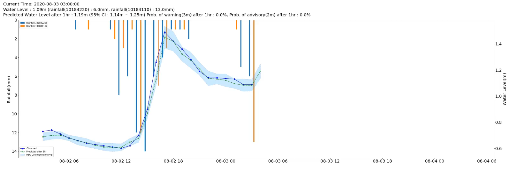
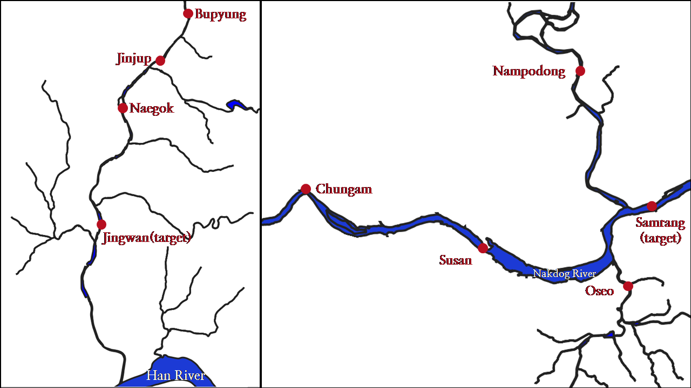

# Short term Water Level Prediction in the river using LSTM with Monte Carlo Dropout

## Index
  - [Overview](#overview) 
  - [Getting Started](#getting-started)
  - [Contributing](#contributing)
  - [Authors](#authors)

## Overview
This project was carried out for the 5th K-water Big Data Competetion to respond to rapid flood near urban areas because of climate change. Input data is used water level and rainfall data for upstream and target area during 24 hours, which were observed per 1 hour in order to predict after 1 hour water level of target area. Also Monte Carlo Dropout was used in this project to support more information such as confidence interval and probability of alert.

## Getting Started

This project assumes you have the following:

 - Google colab
 - Google drive (Mounting google drive on google Colab)

### Data Collection

You can find related notebooks in `/notebooks/collect_data` folder or you can also use csv files in `/data` folder as input data.
If you use csv files in `/data`, you have to copy all files in `/data` folder to your storage first. Google driver could be one of your storage.
Or if you collect data by yourself through OpenAPI, you have to get OpenAPI access key in [this site](http://www.wamis.go.kr:8080/wamisweb/main/mainPage.do). 

Target areas and observation points are follwing :

### Training & Test

You can find related notebooks in `/notebooks/deeplearning_with_MC_Dropout` folder.
In the notebooks, there are 3 type of deep learning models which are LSTM, 1D CNN, and DNN with Monte Carlo Dropout for two target areas where is Jingwan and Samrangjin.

<!-- CONTRIBUTING -->
## Contributing

Contributions are what make the open source community such an amazing place to learn, inspire, and create. Any contributions you make are **greatly appreciated**.

If you have a suggestion that would make this better, please fork the repo and create a pull request. You can also simply open an issue with the tag "enhancement".
Don't forget to give the project a star! Thanks again!

1. Fork the Project
2. Create your Feature Branch (`git checkout -b feature/AmazingFeature`)
3. Commit your Changes (`git commit -m 'Add some AmazingFeature'`)
4. Push to the Branch (`git push origin feature/AmazingFeature`)
5. Open a Pull Request

(<a href="#top">back to top</a>)

<!-- Authors -->
## Authors
  - **Hyunho Lee** 
    - email : <hyunho.lee26@gmail.com>, <hyunho@kwater.or.kr>
    - [Github](https://github.com/hyunholee26)
    - [Linkedin](https://www.linkedin.com/in/hyunho-lee-91a473226/)
    - [Google Scholar](https://scholar.google.com/citations?user=_BauogcAAAAJ&hl=ko)
